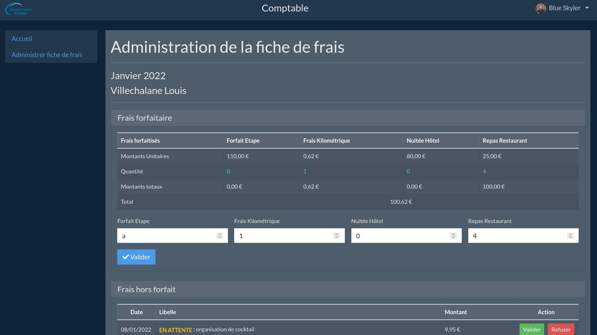

GSB Frais [](#) [](https://github.com/Aaldn/GSB-Frais/blob/master/LICENSE.md)
========================

GSB Frais – par [@Aaldn](https://github.com/Aaldn)

[](https://symfony.com/5) [](https://getcomposer.org/) [](https://www.php.net/) [](https://mariadb.org/) [](https://httpd.apache.org/)

Application d'enregistrement des frais engagés et de suivi des remboursements.

</img> </img> 

### Documentation

  * [Documentation utilisateur](docs/Documentation-Utilisateur.pdf) _(À venir)_
  * [Documentation technique](docs/Documentation-Technique.pdf) _(À venir)_

### Contexte

1. [GSB - Contexte](docs/01-GSB-Contexte.pdf)
2. [GSB - Organisation](docs/02-GSB-Organisation.pdf)
3. [GSB - Cahier des charges](docs/03-GSB-AppliFrais-Description.pdf)
4. [GSB - Exemples](docs/04-GSB-AppliFrais-Commentaires.pdf)
5. [GSB - Architecture de l'existant](docs/05-GSB-Architecture-Application-Existante.pdf)

### Prérequis


  * [Docker](https://docs.docker.com/get-docker)
  * [Docker compose](https://docs.docker.com/compose/install)

> En cas de difficulté, reportez-vous à la documentation officielle de [Docker](https://docs.docker.com/).

## Installation

Tout d'abord, clonez ce dépôt puis placez vous au sein du projet :

```bash
$ git clone https://github.com/Aaldn/GSB-Frais /var/www/GSB-Frais
$ cd /var/www/GSB-Frais
```

Ensuite, construisez et lancez les conteneurs Docker :

```bash
$ docker-compose up -d --build
```

Enfin, exécutez le script d'initialisation de l'application :

```bash
$ chmod +x script/start.sh && ./script/start.sh
```

Vous pouvez maintenant accéder à l'application depuis votre navigateur à l'URL suivante : [`http://localhost:9973`](http://localhost:9973)

> Vous avez la possibilité de repeupler la base de données avec un nouveau jeu de données grâce aux fixtures :
>```bash
> $ ./script/fixtures.sh
>```

## Fonctionnement

Voici les services déclarés dans le fichier `docker-compose.yml` :

* `db` : Le conteneur de la base de données MariaDB (qui peut être modifié par un autre SGBD),
* `www` : Le conteneur PHP incluant le volume de l'application monté dessus.

Les conteneurs en cours d'exécution sont donc les suivants :

```bash
$ docker-compose ps
    Name                    Command                State                 Ports
----------------------------------------------------------------------------------------------------
gsb_frais_db     docker-entrypoint.sh --def ...   Up            3306/tcp
gsb_frais_www    docker-php-entrypoint apac ...   Up            0.0.0.0:9973->80/tcp,:::9973->80/tcp
```

La commande suivante vous permet d'entrer dans le shell d'un des conteneurs : 

```bash
$ docker exec -it <nom_du_conteneur> bash
```

> Vous pouvez personnaliser votre environnement (ports, volumes...) en modifiant le fichier `docker-compose.yml`.
## Licence

Voir le fichier [LICENSE.md](https://github.com/Aaldn/GSB-Frais/blob/master/LICENSE.md) fourni.